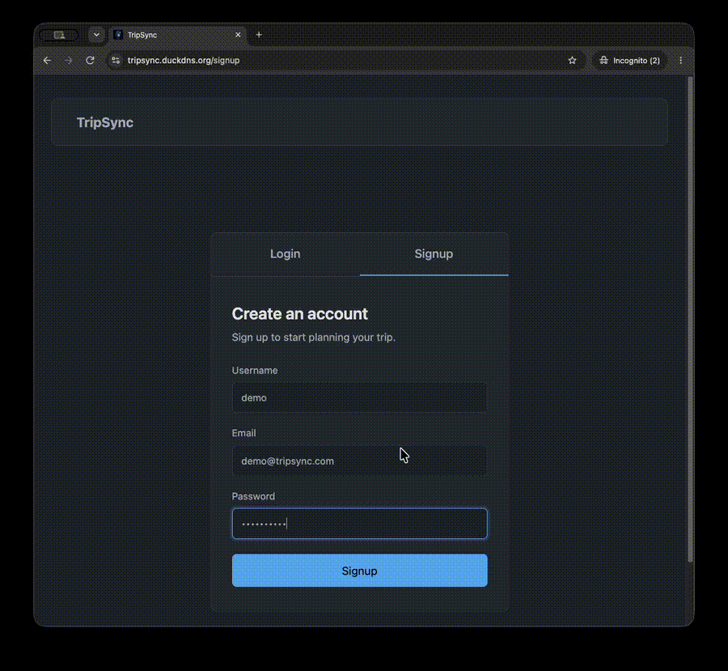

# TripSync

A collaborative travel-planning app for groups. Members join a travel group and **vote** on which trip to take and which activities to do — itinerary, activities, and costs in one place.

## Demo



**Team 2 · Code Platoon (Dakota cohort)** — Cody · Dom · Kaylee · Mohamed · Simon · Abdel

## Start here

| If you want…                                                                      | Go to                                                                                             |
| --------------------------------------------------------------------------------- | ------------------------------------------------------------------------------------------------- |
| The full project context — scope, features, data model, workflow                  | [`resources/README.md`](resources/README.md)                                                      |
| **What you're working on today**                                                  | [`resources/work-breakdown-2026-08-31.md`](resources/work-breakdown-2026-08-31.md)                |
| The database schema                                                               | [`resources/ERD.sql`](resources/ERD.sql) · [diagram](resources/travel_planner_erd.png)            |
| Wireframes and shared components                                                  | [`resources/wireframes/`](resources/wireframes) · [`resources/components/`](resources/components) |
| Course requirements                                                               | [`resources/1_project_requirements.md`](resources/1_project_requirements.md)                      |
| **Deploying to EC2** — env file, `make deploy`, TLS, what to check when it breaks | [`DEPLOY.md`](DEPLOY.md)                                                                          |

## Stack

Django + DRF · PostgreSQL · Vite + React · Docker Compose · GitHub Actions · AWS EC2

## Layout

```
backend/       Django project (tripsync_proj)
frontend/      Vite + React app
resources/     Planning docs, ERD, wireframe exports
docker-compose.yml       Dev stack (runserver + vite)
docker-compose.prod.yml  EC2 stack (gunicorn + nginx) - see DEPLOY.md
SharedNotes.md Running team notes
```

## Running it

Setup steps land in [`backend/Backend.md`](backend/Backend.md) and [`frontend/Frontend.md`](frontend/Frontend.md) as those pieces get scaffolded — see the work breakdown for who owns each.

## Contributing

One issue = one assignee = one branch = one PR. Branch off `main` as `<epic>/<short-desc>`; PRs reference their issue (`Closes #12`) and need one review before merge. Full conventions in [`resources/README.md`](resources/README.md#workflow-github-projects).
