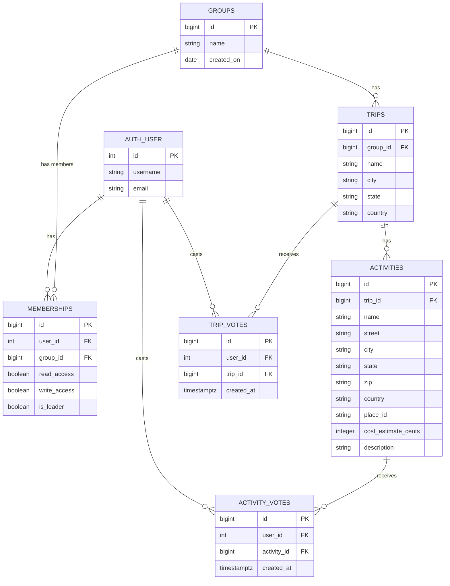

# TripSync — Group Travel Planning App

> **Team 2** · Code Platoon (Dakota cohort) group project
>
> This README is the single source of truth for project scope and context. It drives three things: **Figma wireframes** (see [Pages & Wireframes](#pages--wireframes-figma)), the **GitHub Projects board** (see [Workflow](#workflow-github-projects)), and **Claude Code sessions** working in this repo.

## Pitch

For groups of friends and travelers who struggle to coordinate a trip itinerary, activities, and expenses, **TripSync** is a collaborative travel-planning app that integrates all three in one place. Unlike mainstream travel apps, TripSync users join a travel group and **vote** on which trip to take and which activities to do. If a trip or activity is voted off the table, a new one can be voted in.

## Problems & Solutions

| # | Problem | Solution |
|---|---------|----------|
| 1 | It's difficult for a group (e.g., a bachelor party) to collectively decide **where to go** | Users vote on trips to answer *"where are we going?"* — one trip vote per user per group |
| 2 | It's difficult for a group to collectively decide **what to do** on the trip | Users vote on activities to answer *"what are we doing?"* |

## Team (6 members)

| Member | Role(s) |
|--------|---------|
| Cody | Back End · Project Manager |
| Dom | Back End · Project Manager |
| Kaylee | Back End · AWS / CI-CD |
| Mohamed | Front End · AWS / CI-CD |
| Simon | Front End |
| Abdel | Front End · QA/QC |

## Tech Stack

Required by the Code Platoon project spec (`1_project_requirements.md`):

| Layer | Technology |
|-------|------------|
| Front End | Vite + React, React Router DOM, Axios |
| Front-End Testing | Cypress (E2E) |
| Back End | Django + Django REST Framework, Token/JWT authentication |
| Back-End Testing | Django TestCase |
| Database | PostgreSQL (via Psycopg3) |
| Containerization | Docker Compose |
| Network | Gunicorn + Nginx |
| CI/CD | GitHub Actions |
| Deployment | AWS EC2 (t3.micro) |

### Graded feature requirements

- [ ] Token/JWT auth: register, login, logout, confirmation
- [ ] Minimum **2 CRUD resources** (not the user profile) — we have three planned: **Groups, Trips, Activities**
- [ ] Minimum **2 third-party APIs**: 1 client-side (**Google Maps JS**) + 1 server-side requiring auth (**Google Geocoding / Places**)
- [ ] Dynamic user interface
- [ ] Graceful error handling: appropriate HTTP responses and UI error states

### Deliverables

- Deployed application on AWS EC2
- Demo video (≤ 10 min hard stop): what it is → feature demo → challenges & next steps
- Presentation materials: **wireframes, schema, user stories**

## Data Model

Full schema in [`ERD.sql`](./ERD.sql) (PostgreSQL, Django-style — translate directly into models). The diagram below and [`travel_planner_erd.png`](./travel_planner_erd.png) (rendered from [`erd.mmd`](./erd.mmd)) both match `ERD.sql` — when the schema changes, update all three; the regen command is in `erd.mmd`'s header.

| Table | Purpose | Key fields |
|-------|---------|-----------|
| `auth_user` | Django built-in user | username, email |
| `groups` | A travel group | name, created_on |
| `memberships` | User ↔ Group join table | read_access, write_access, is_leader · unique (user, group) |
| `trips` | A candidate/planned trip, belongs to a group | name, city, state, country |
| `activities` | An activity, belongs to a trip | name, address fields, place_id, cost_estimate_cents, description |
| `trip_votes` | User ↔ Trip vote | created_at · unique (user, trip) |
| `activity_votes` | User ↔ Activity vote | created_at · unique (user, activity) |

**Relationships:** a group has many trips → a trip has many activities. Users belong to many groups through `memberships`, and vote through `trip_votes` and `activity_votes`. All FKs cascade on delete.

**Conventions:**
- Money is stored as **integer cents** (`cost_estimate_cents`) — divide by 100 for display, never store floats for currency. Activity cost is a user-entered estimate, not a fetched value.
- **Derived, never stored:** group member count = `COUNT` of its memberships; trip total cost = `SUM` of its activities' estimates. Use Django `annotate`/`aggregate` in the queryset.
- **Voting rules:** double-voting the same item is blocked at the DB level (unique constraints). The one-trip-vote-per-user-**per-group** rule is enforced in the API: casting a trip vote replaces the user's existing vote in that group.

## Features (MoSCoW)

### Must / Should

**Authentication** — create account, log in, log out, view profile, delete account.

**Groups (CRUD #1)**
- Create a group: name, created-on date
- Any user can join or leave a group; groups are open to all users
- View all members of a group; view all groups you belong to
- Group creators: flagged as creator; grant/revoke member read access; grant/revoke member write access; remove a member; rename the group; delete the group

**Trips (CRUD #2)**
- Create a trip: name, destination city, state, country
- Assign a trip to a group; view all trips in a group; edit and delete trips

**Activities (CRUD #3)**
- Add, edit, delete, save activities; view all activities for a trip
- See an activity plotted on the map

**Voting (CRUD #4)** — the differentiator; ships with the MVP
- Vote on a trip — one active trip vote per user per group; voting for a different trip switches your vote
- Vote on an activity; remove a vote
- See whether you've already voted; see vote counts
- Double-voting the same item is impossible (DB unique constraints)

**Third-party APIs**
- Server-side: Google Geocoding / Places ID (authenticated)
- Client-side: Google Maps JS

### Could

**Totals & Counts** — computed aggregates surfaced in the UI: trip total cost (sum of activity estimates), group member count. (Vote counts ship with Voting above.)

**Group access (stretch)** — invite link users can email/text themselves; optional group password set by the group admin to restrict joining.

## Pages & Wireframes (Figma)

**Figma file: [TripSync Wireframes](https://www.figma.com/design/NHZW86Irpy2MNiKidw2Mdd)** — the 🧩 Components page holds the shared components; the 📱 Wireframes page has one frame per screen, grouped into AUTH / CORE / UTILITY rows.

One Figma frame per page below. Build the [shared components](#shared-components) first as Figma components, then compose pages from them.

### Home Page
- **Group card** at top above the map — clickable through to Groups Page (in addition to navbar)
- **Trip card** at top above the map — clickable through to Trips Page (in addition to navbar)
- Google Map (Maps JS) with pins for every activity's Place ID
- Button that takes the user to the Trip Detail page

### Groups Page
- Full CRUD on groups
- Automatically displays every member of a given group
- All groups open to be joined by any user
- *Could:* invite-link generation; group password entry

### Trips Page
- Trip cards showing **destination only**; activities are viewable per trip but read-only here (no create/update/delete)
- Full CRUD for trips
- Trip voting: one trip vote per user per group — voting for a different trip switches your vote
- Trip card clicks through to Trip Detail (in addition to navbar)

### Trip Detail / Activities Page
- Activity cards showing **where, what, and cost** (later: *when*, based on time available)
- Full CRUD on all three activity fields
- Add an activity by selecting from Google Places search
- Manual-address fallback: street, city, state, zip, country are optional fields for places without a Google Places entry — the server-side Geocoding API resolves lat/long and a new Place ID
- Cost is a user-entered estimate
- Activity voting: users vote for the activities they want on this trip

### Auth & Utility Pages
- **Login Page**
- **Create User (Sign Up) Page**
- **Authenticated landing** (post-login view — may merge with Home; decide during wireframing)
- **About Page** — Team 2 bios
- **404 Page** and **Error Page**

### Shared components

Design these once in Figma; they map 1:1 to React components later:

`NavBar` · `GroupCard` · `TripCard` · `ActivityCard` · `MapView` · `VoteButton` · error/empty states

## Workflow (GitHub Projects)

We use a **GitHub Projects board** as our Trello-style task board. Every task is a GitHub Issue assigned to exactly one member.

**Columns:** Backlog → Ready → In Progress → In Review → Done

**Conventions:**
- One issue = one assignee = one branch = one PR; PRs reference their issue (`Closes #12`)
- Work on feature branches, never directly on `main`; at least one review before merge
- Label issues by epic so the board filters by workstream

**Epics → owners** (starting point; PMs adjust as the board evolves):

| Epic / Label | Scope | Primary owners |
|--------------|-------|----------------|
| `auth` | JWT register/login/logout, profile | Cody, Dom, Kaylee |
| `groups` | Groups CRUD + memberships/permissions | Back End + Front End pair |
| `trips` | Trips CRUD + trip voting | Back End + Front End pair |
| `activities` | Activities CRUD + activity voting | Back End + Front End pair |
| `maps` | Google Maps JS, Places search, Geocoding | Mohamed, Simon, Abdel |
| `wireframes` | Figma frames + shared components | Front End team |
| `infra` | Docker Compose, Gunicorn/Nginx, GitHub Actions, EC2 | Kaylee, Mohamed |
| `qa` | Cypress E2E, Django TestCase coverage | Abdel |

## Design Decisions

The running record of schema and scope calls, with rationale — add to it as decisions land.

1. **Trip voting gets its own `trip_votes` table**, and `votes` is renamed **`activity_votes`** so the pair is symmetric. Two identical-shaped tables beat one polymorphic vote model: real foreign keys with cascade deletes, simple unique constraints, and two straightforward DRF serializers instead of one clever one.
2. **Voting is a Must**, not a Could — it's the pitch's differentiator. Activities (CRUD #3) moves up with it, since activity voting can't exist without activities.
3. **Group member count is computed, not stored** — dropped `groups.member_count`. A stored counter has to be updated in the same transaction as every join/leave or it silently drifts from the truth in `memberships`. At our scale, `COUNT` on an indexed FK is effectively free.
4. **Trip total cost is computed, not stored** — dropped `trips.total_cost_cents` for the same reason: it's fully derivable as the `SUM` of the trip's activity estimates, and every activity create/edit/delete would otherwise have to keep it in sync. Denormalize later only if profiling proves we need to.
5. **The per-group trip-vote limit lives in the API, not the DB.** The DB enforces what it can express cheaply (unique user+trip, unique user+activity). Enforcing "one trip vote per user per group" in the DB would require a redundant `group_id` on `trip_votes` — the same drift risk we just removed in #3–4. Instead, the vote endpoint replaces the user's existing trip vote within that group.

## Repo Contents

Planning docs live in `resources/` (this directory); app code lives at the repo root (`backend/` Django project, `frontend/`, `compose.yaml`).

| File | What it is |
|------|-----------|
| `README.md` | This file — project source of truth |
| `1_project_requirements.md` | Code Platoon requirements doc (tech stack, graded features, presentation format) |
| `ERD.sql` | PostgreSQL schema — source of truth for the data model |
| `erd.mmd` | Mermaid source for the ERD diagram — keep in sync with `ERD.sql` (regen command in its header) |
| `travel_planner_erd.png` | ERD diagram rendered from `erd.mmd` — matches `ERD.sql` |
| `wireframes/` | PNG exports of the Figma wireframe screens |
| `components/` | PNG exports of the shared Figma components |
